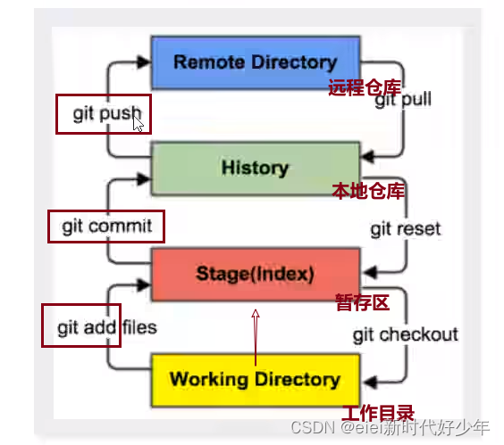
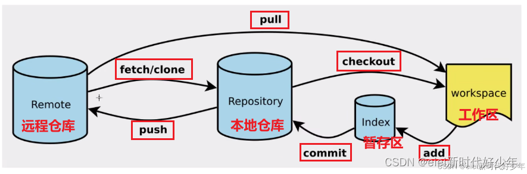

# 七院创新基地2023年换届考核
## 2023年换届考核
* 考核成员：21级
* 参会成员：全体成员
* 考核要求：需要带自己电脑，考核需要展示自己的学习成果、项目等
* 时间：周六晚上7点
* 地点：暂定06303

## 必知必会-git操作

**参考博文**

* [git文档](https://git-scm.com/book/zh/v2)

* [【GitHub】——如何拉取github代码到本地并进行开发](https://blog.csdn.net/qq_50497708/article/details/126873083)
* [Github日常使用流程(多人开发环境)](https://blog.csdn.net/vaylove/article/details/127710447)
* [[Git]Git - GitHub远程仓库操作](https://blog.csdn.net/m0_53022813/article/details/127576265)
* [https://github.com/livoras/blog/issues/7](使用git和github进行协同开发流程)

### 一般使用方式

* 1、（如果本地该文件夹没有初始化过）初始化本地文件夹

~~~shell
git init
~~~

* 拉取远程仓库主分支文件

~~~shell
git push origin master
~~~

* 2、添加文件到暂存区

* * 添加所有文件

* ~~~shell
  git add .
  ~~~

* * 添加特定文件

* ~~~shell
  git add 1.png
  ~~~

* 3、添加注释

~~~shell
git commit -m "first commit"
~~~

* 4、起别名

~~~shell
git remote add 别名 远程地址
git remote add origin 远程地址
~~~

* 推送到远程仓库

~~~shell
git push 
~~~

### 拉取远程仓库

* 拉取远程仓库有两种方式
* 第一种：不用初始化本地仓库，简单方便

~~~shell
git clone 远程仓库地址
git clone git@github.com:seven-innovation-base/Presentation-of-2023-new-evaluation-results.git
~~~

* 下面讲第二种

#### 1、在自己本地文件夹 初始化 本地仓库

~~~shell
git init
~~~

*如果第一次使用git*，需要配置如下

~~~shell
# 在Git Bash中输入以下命令
git config --global user.name "你的用户名"
git config --global user.email 你的邮箱
~~~

**例如**

~~~shell
git config --global user.name "Axieyun"
git config --global user.email 1993539830@qq.com
~~~

#### 2、将远程仓库对应分支最新的内容 拉下来后与当前本地分支直接合并

~~~shell
git pull 远程库地址别名 远程分支名
~~~

### 3、推送本地分支上的内容到远程仓库

~~~shell
git push 别名 分支
~~~

#### 4、给远程仓库起别名

~~~shell
git remote add 别名 远程地址
~~~

#### 5、查看当前所有远程地址别名

~~~shell
git remote -v
~~~

## 多人合作开发

### 1、fork源仓库到自己github账号

#### 2、把自己fork的仓库clone到本地

~~~shell
git clone
~~~

#### 3、开发功能（收集部门成员的考核成果）

#### 4、向管理员（源仓库）提交pull request

* 点击上图的绿色按钮，开发者就可以就可以静静地等待管理员对你的提交的评审了。

